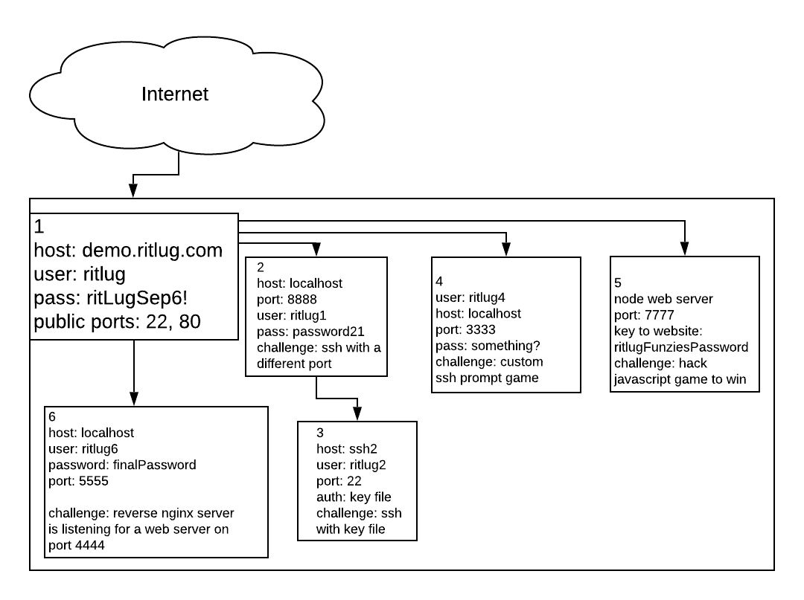

# Answers to the Challenge




## 1 Basic SSH

SSH into main VM with given username and password.

```
ssh ritlug@demo.ritlug.com
```

## 2 SSH With Different Port

SSH into container on the main VM with a different port.

```
# on main connection(demo.ritlug.com)
ssh ritlug1@localhost -p 8888
```

## 3 SSH With Key File

While in the first container, ssh into another container with a key file.

```
# on ritlug1@localhost connection
ssh ritlug2@ssh2 -i id_rsa
```


## 4 SSH into Custom SSH Python Server

SSH into a VM and answer questions about RITlug.

```
# on main ssh connection
ssh ritlug4@localhost -p 3333
```

## 5 Access and Play and Hack Game on Internal Web Server

Forward localhost:someport to remote the remote machine's localhost:7777 so you can access the website on your computer.


```
# On your computer
ssh -L 7777:localhost:7777 ritlug@demo.ritlug.com
```

Open web browser and play the game....
The game is way to hard to win; hack it!

There are many ways to hack this basic Javascript game, but, the most basic is to just tell the server that you are scoring a ton of points and then navigate to the /endgame page. 


```javascript
//run this in the console of the game or end game page
for(var i = 0; i < 500; i++)
{
	console.log("Sending stonks.");
	$.ajax({
		type:'POST',
		url: "/stonks",
		crossDomain: true,
		dataType: "json",
		timeout: 3000
	});
}
```

## 6 Forward Local Web Server to Remote Host

```
# forward the ssh port of the remote machine to your local computer.
ssh -L 5555:localhost:5555 ritlug@demo.ritlug.com

# forward your web server to the remote machine
ssh ritlug6@localhost -p 5555 -R 4444:localhost:8989
```


# Installation and Running on Debian VM

## Install Docker

```
apt update
apt upgrade
apt install apt-transport-https ca-certificates curl software-properties-common gnupg2
curl -fsSL https://download.docker.com/linux/debian/gpg | sudo apt-key add -
add-apt-repository "deb [arch=amd64] https://download.docker.com/linux/debian $(lsb_release -cs) stable"

apt update
apt install docker-ce
```


## Install Docker-Compose

```
curl -L https://github.com/docker/compose/releases/download/1.25.0-rc2/docker-compose-`uname -s`-`uname -m` -o /usr/local/bin/docker-compose
chmod +x /usr/local/bin/docker-compose
```


## Create Firewall

Create firewall to block everything that is not ports 80 or 22

```
apt-get install ufw
ufw enable
ufw allow 22:80/tcp
ufw deny 1000:9999/tcp
```

### Docker Firewall Trickery

Docker tampers directly with IPTables, so, ufw alone won't block people from accessing the internal services running on ports 7777, etc.

#### When When Running Single Container

Edit /etc/default/docker and uncomment the DOCKER_OPTS line:

```
DOCKER_OPTS="--dns 8.8.8.8 --dns 8.8.4.4 --iptables=false"
```

#### Running Docker Compose

Since we are using systemd with Docker Compose, we have to set the iptables flag by creating the following file with:

/etc/docker/daemon.json

```
{
    "iptables": false
}
```


## Add Base User For Demo

```
useradd -ms /bin/bash ritlug
echo ritlug:ritLugSep6! | chpasswd
```

## Install project files on system

```
git clone https://github.com/jrtechs/ssh-challenge.git

cd ssh-challenge

# Prevents the ritlug user from modifying the hint file
cp hint.md /home/ritlug/hint.md
chmod 0555 /home/ritlug/
```

# Running the Project

```
docker-compose build
docker-compose up
```
